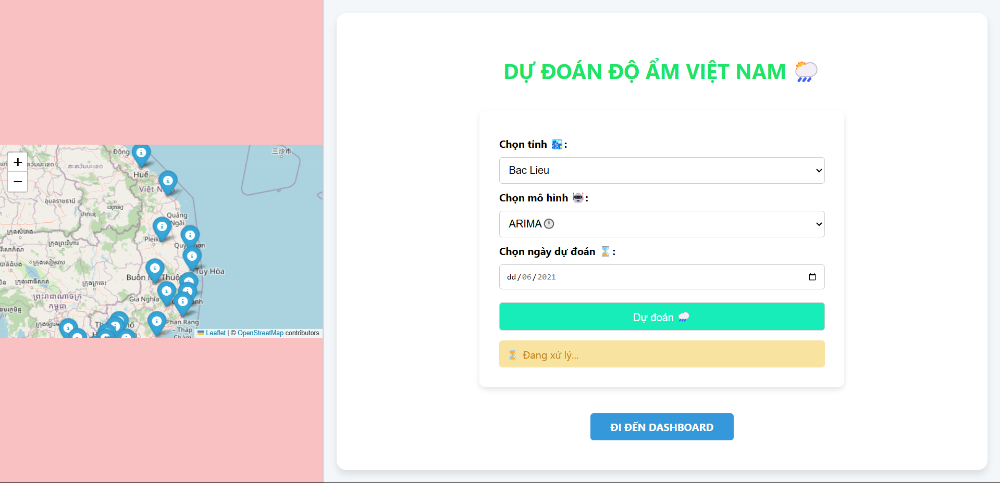

---

# Hệ Thống Dự Báo Độ Ẩm Cho Các Tỉnh Việt Nam


Hệ thống này được phát triển để dự báo độ ẩm cho 39 tỉnh tại Việt Nam, sử dụng dữ liệu lịch sử từ năm 2009 đến 2021. Dự án tích hợp các công nghệ học máy và web framework để cung cấp dự đoán chính xác và giao diện thân thiện với người dùng.


## Mục tiêu
- Dự báo độ ẩm dựa trên dữ liệu lịch sử.
- Hỗ trợ phân tích xu hướng độ ẩm theo thời gian cho các tỉnh Việt Nam.
- Cung cấp một công cụ trực quan, dễ sử dụng cho người dùng cuối.

## Đặc điểm nổi bật
- **Dữ liệu**: Dựa trên dữ liệu độ ẩm của 39 tỉnh Việt Nam từ 2009-2021.
- **Công nghệ**: Sử dụng TensorFlow cho học máy và Django cho phát triển web.
- **Tính năng**: Dự báo, phân tích và trực quan hóa dữ liệu độ ẩm.

## Cài đặt

### Yêu cầu
- Python 3.9 hoặc cao hơn
- pip (quản lý package Python)
- Git (để clone repository)

### Hướng dẫn cài đặt
1. **Clone repository**:
   ```bash
   git clone https://github.com/MinhHieu13-cmc/Humidity-forecast-in-Vietnamese-provinces
   cd <Humidity-forecast-in-Vietnamese-provinces>
   ```

2. **Tạo môi trường ảo** (khuyến nghị):
   ```bash
   python -m venv venv
   source venv/bin/activate  # Trên Linux/Mac
   venv\Scripts\activate     # Trên Windows
   ```

3. **Cài đặt các thư viện cần thiết**:
   ```bash
   pip install -r requirements.txt
   ```

4. **Chạy ứng dụng**:
   ```bash
   python manage.py migrate  # Khởi tạo cơ sở dữ liệu (nếu có)
   python manage.py runserver
   ```
   Truy cập ứng dụng tại: `http://127.0.0.1:8000/`

## Cấu trúc dự án
```
<Humidity-forecast-in-Vietnamese-provinces>/
│
├── data/                  # Dữ liệu độ ẩm (2009-2021)
├── prediction/           # Mô hình học máy
├── WeatherPrediction/                   # Ứng dụng Django
├── requirements.txt       # Danh sách các thư viện
└── README.md              # Tài liệu này
```

## Công nghệ sử dụng
- **Backend**: Django 5.1.4
- **Machine Learning**: TensorFlow 2.13.0, scikit-learn 1.6.0
- **Frontend**: Jinja2 3.1.4 (template engine)
- **Xử lý dữ liệu**: Pandas 2.2.3, NumPy 1.24.3
- **Trực quan hóa**: Matplotlib, Folium 0.18.0

Xem chi tiết trong file `requirements.txt`.

## Dữ liệu
Dự án sử dụng dữ liệu độ ẩm của 39 tỉnh Việt Nam từ năm 2009 đến 2021. Dữ liệu này được thu thập và xử lý để phục vụ việc huấn luyện mô hình dự báo.

## Hướng dẫn sử dụng
1. **Khởi động hệ thống**: Chạy server Django như hướng dẫn ở trên.
2. **Tải dữ liệu**: Đảm bảo dữ liệu đã được đặt trong thư mục `data/`.
3. **Dự báo**: Truy cập giao diện web để nhập thông tin tỉnh và xem kết quả dự báo.


## Liên hệ
Nếu bạn có câu hỏi hoặc cần hỗ trợ, vui lòng liên hệ qua email: `<hieu89062@gmail.com>` hoặc mở issue trên GitHub.

---
